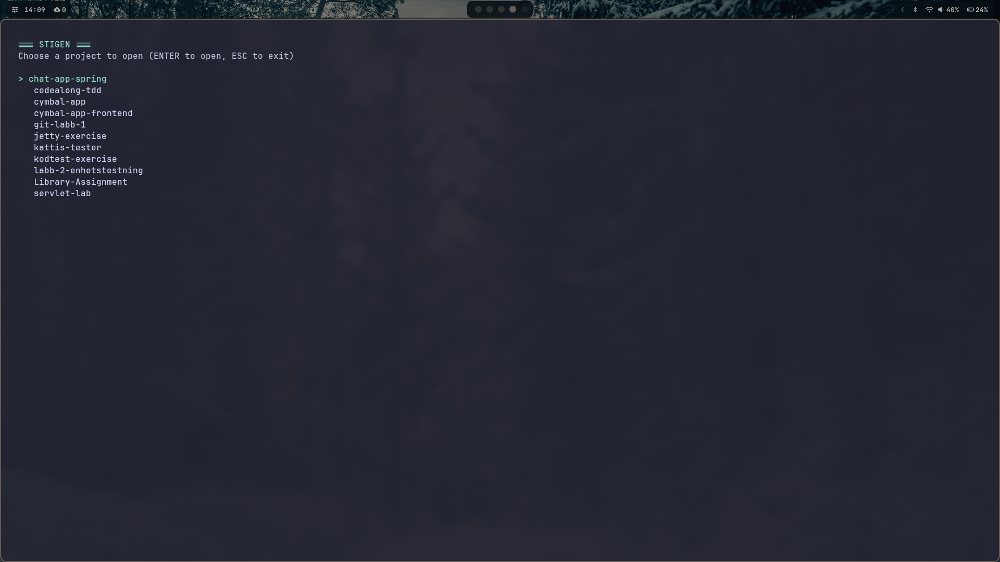

# Stigen 🌲

A blazing-fast TUI (Terminal User Interface) project launcher to navigate and open your Java projects directly from the terminal. Built with Java and Lanterna.

## Screenshot



## About The Project

`Stigen` (Swedish for "The Path") is a simple yet powerful terminal utility designed to streamline the workflow for developers with many local projects. Instead of `cd`'ing and `ls`'ing through directories, Stigen provides an interactive list of all your Java projects, allowing you to open any of them in IntelliJ IDEA with a single keystroke. The application is now fully configurable, allowing you to specify your project scanning directory.

## Built With

*   [Java](https://www.java.com/)
*   [Maven](https://maven.apache.org/)
*   [Lanterna](https://github.com/mabe02/lanterna)

## Getting Started

To get a local copy up and running, follow these simple steps.

### Prerequisites

*   Java (JDK 17 or later)
*   Maven
*   IntelliJ IDEA (with the command-line launcher installed)

### Installation & Running

1.  Clone the repo (replace with your repo URL):
    ```sh
    git clone https://github.com/your-username/stigen.git
    ```
2.  Navigate to the project directory:
    ```sh
    cd stigen
    ```
3.  Compile the application:
    ```sh
    mvn compile
    ```
4.  Run the application:
    ```sh
    # Run with default/saved directory
    mvn exec:java -Dexec.mainClass="se.iths.fabian.ProjectLauncher"

    # Run with a specific directory (overrides default/saved setting)
    mvn exec:java -Dexec.mainClass="se.iths.fabian.ProjectLauncher" -Dexec.args="/path/to/your/projects"
    ```
    Or use your `stigen` alias if you have set it up!

## Usage

*   Use the **Up/Down arrow keys** to navigate the project list.
*   Press **Enter** to open the selected project in IntelliJ IDEA.
*   Press **s** to access the **Settings** screen (more info below).
*   Press **/** to enter **Search** mode.
*   Press **Escape** to cancel search or return from settings.
*   Press **q** to exit the application.

## Configuration

Stigen allows you to customize the default directory it scans for projects.

### Default Project Directory

By default, Stigen will try to scan your home directory (`~`). You can change this in two ways:

1.  **Using the Settings Screen:**
    *   Press **s** within the application to enter the settings.
    *   Type the desired absolute path to your projects directory (e.g., `/home/youruser/dev/java`).
    *   Press **Enter** to save your changes. The application will immediately reload projects from the new directory.
    *   Press **Escape** to cancel changes and return to the main screen.
    *   This setting is saved persistently in `~/.stigen/config.properties`.

2.  **Via Command-Line Argument:**
    *   You can override the default or saved setting by providing a path as a command-line argument when launching the application:
        ```sh
        mvn exec:java -Dexec.mainClass="se.iths.fabian.ProjectLauncher" -Dexec.args="/path/to/override/projects"
        ```
    *   This argument takes precedence over the saved configuration for that specific run.

### Configuration File Location

Your personal settings are stored in a file located at: `~/.stigen/config.properties`. This file is automatically created the first time you save a setting. It is not part of the project's Git repository.